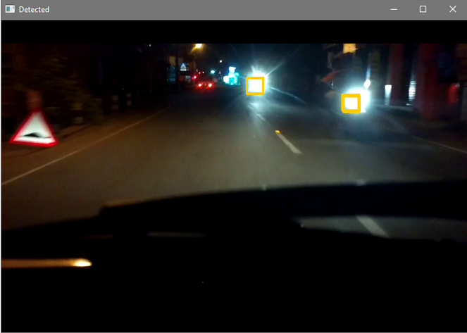

# Adaptive-Headlight-Control-System-using-OpenCV

## About

The main objective of our project is to detect headlights of oncoming vehicles and thereby controlling the intensity of headlights using Raspberry Pi and OpenCV library. Whenever an oncoming headlight is detected, headlight of our vehicle is switched to low beam based on a delay algorithm. Hence, visibility of the driver is improved and thereby reducing the occurrence of accidents.

## Setup
This part includes the the basic setup used to run the application.

Libraries used in the application are:
•	OpenCV\

## Testing

1. Extract the zip folder 
2. To run the application, go to the base directory containing the file detect.py’ 
3. Execute python detect.py.
4. The video with live headlight detection pops up.

